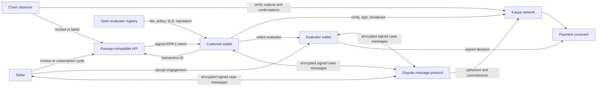
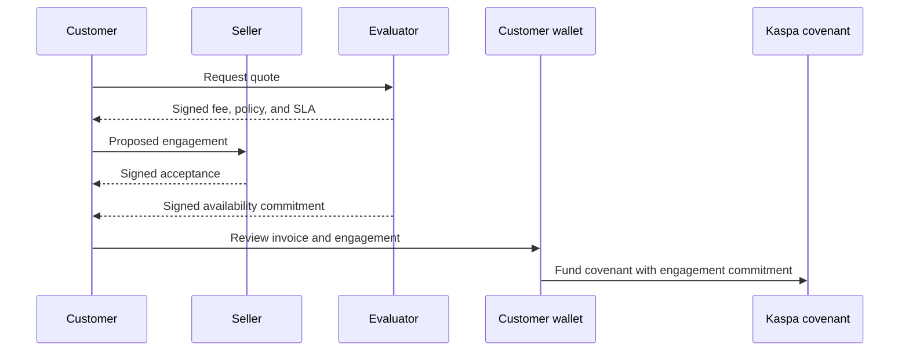

# Kasway: Verifiable Commerce Payments on Kaspa

**Status:** Public technical whitepaper draft

**Version:** 0.3

**Date:** 31 August 2026

**Author:** Donny Pratama ([furatamasensei](https://github.com/furatamasensei)) — <donny@atomiklabs.org>

**Co-authors:** Claude (Anthropic), Codex (OpenAI)

**Reference implementation:** [github.com/furatamasensei/kasway-axum](https://github.com/furatamasensei/kasway-axum)

## Abstract

Kasway is an open-source commerce-payment protocol for Kaspa. It combines signed KPR-1 payment intents, self-custodial wallet authorization, chain observation, and covenant-enforced settlement. Kasway gives merchants an invoice and subscription workflow without requiring customers to deposit recurring funds into a platform-controlled balance.

Each payment uses a fresh, signed, single-use invoice. A customer wallet verifies the invoice, signs and broadcasts locally, and submits the transaction identifier for observation. A chain observer verifies the required payment outputs before treating the covenant as funded. The covenant then enforces release, refund, mutual settlement, and time-based paths.

Kasway's target dispute protocol adds an open marketplace of pseudonymous evaluators. A customer selects an evaluator by fee, policy, service level, and reputation; the seller and evaluator must accept the same engagement before funding. If a dispute occurs, buyer, seller, and evaluator use a signed, end-to-end encrypted case room whose message commitments are sequenced on Kaspa. Kasway backends never receive private keys, plaintext messages, or decryption keys.

## 1. The problem

Commerce payments often collapse different events into one vague status: payment sent, payment observed, funds held, goods delivered, and funds released. That ambiguity creates operational risk for customers, merchants, and software agents.

Recurring payments introduce another problem. A conventional subscription system can retain a reusable payment credential or a pre-funded balance under a provider's control. That model weakens customer control and makes price changes, retries, and cancellation harder to reason about.

Commerce disputes add an off-chain truth problem. A blockchain can verify signatures, amounts, destinations, and timestamps, but it cannot independently determine whether a physical item arrived, a service met its specification, or submitted evidence is truthful. Kasway therefore separates verifiable payment enforcement from human or machine evaluation of off-chain evidence.

## 2. Design principles

Kasway follows seven principles.

1. **Customer custody remains local.** Kasway APIs never receive a seed phrase, private key, extended key, wallet key reference, or decryption key. Production signing belongs in native-secure wallet storage.
2. **Every payment is a signed, bounded intent.** Each invoice carries the amount, required outputs, expiry, merchant metadata, and signature metadata that the wallet verifies before it signs.
3. **Funding and settlement are separate facts.** The chain observer verifies funding independently. Settlement occurs only when the covenant is spent through an authorized path.
4. **Subscription authority remains with the customer.** Auto-renew requires explicit opt-in. The wallet fetches and verifies every new invoice before it signs; Kasway does not hold a pre-funded subscription balance.
5. **Kasway does not appoint the decision-maker.** Evaluators publish their own terms in an open registry. The customer selects an evaluator, and the seller and evaluator accept the engagement before funding.
6. **Dispute actions remain attributable without requiring legal identity.** Evaluators use pseudonymous cryptographic profiles, signed terms, case-specific keys, and reputation derived from settled cases.
7. **Sensitive content remains under participant control.** Wallets encrypt and decrypt locally. Backends and indexers process only public metadata, ciphertext, commitments, signatures, and transaction identifiers.

## 3. System architecture

Kasway separates commerce orchestration, wallet custody, chain enforcement, dispute communication, and public indexing.



The Kasway API provides merchant, invoice, checkout, subscription, webhook, and persistence services. The customer wallet owns payment authorization, local verification, transaction signing, local activity, optional auto-renew, and dispute-message decryption. Evaluators and sellers also keep their signing and messaging keys locally.

The `kasway-covenant` component compiles settlement constraints and constructs covenant spends. Every covenant script byte is produced by the [SilverScript](https://kasmedia.com/article/hail-the-silverscript) compiler (`silverscript_lang`); Kasway contains no hand-assembled opcodes. Public indexers improve discovery and synchronization, but they are not protocol authorities. Any compatible indexer can reconstruct registry entries, case commitments, and reputation receipts from public chain data.

### 3.1 Cryptographic primitives

The implemented protocol uses the following primitives. Where the target dispute protocol (sections 6–9) introduces new commitments, this document specifies the same hash family unless a later specification says otherwise.

| Purpose | Primitive |
| --- | --- |
| KPR-1 intent signature | Ed25519 over the canonical JSON encoding of the unsigned intent (UTF-8; object keys sorted lexicographically at every depth). Signature and public key travel base64-encoded; the signature block carries `alg: "ed25519"` and a `keyId`. |
| KPR-1 canonical intent hash | SHA-256 (hex) over the canonical JSON encoding of the signed intent. The payment-request URI carries this hash, binding the QR code to the exact document the wallet fetches. |
| Merchant rate-config commitment | SHA-256 (hex) over a canonical JSON encoding of the merchant's payout address, tax, revenue splits, and platform fee. |
| Participant keys and addresses | secp256k1 with BIP-340 Schnorr signatures; participant identities are 32-byte x-only public keys. Customer refund, merchant payout, and arbiter panel addresses must be Schnorr P2PK. |
| Covenant spends | 65-byte input signatures (64-byte BIP-340 Schnorr plus the `SIG_HASH_ALL` type byte) over Kaspa's consensus transaction sighash. Off-chain authorizations verified by the backend are 64-byte BIP-340 signatures over a 32-byte digest. |
| Covenant address | Kaspa P2SH. The script public key is `[OP_BLAKE2B, OP_DATA_32, <32-byte hash>, OP_EQUAL]`, so the covenant address commits to the BLAKE2b-256 hash of the SilverScript-compiled redeem script. |
| Dispute-protocol commitments (target) | SHA-256 over a canonical encoding, matching the KPR-1 intent hash. This includes the decision commitment of section 8. The Kasia-derived message-encryption suite is selected during the security review required by section 15. |

### 3.2 Network prerequisites

Kasway covenants require Kaspa consensus support for covenants and transaction introspection. That support shipped in the [Toccata](https://docs.kaspa.org/toccata) consensus upgrade (KIP-16, KIP-17, KIP-20, KIP-21), released as [rusty-kaspa v2.0.0](https://github.com/kaspanet/rusty-kaspa/releases/tag/v2.0.0) and activated on Kaspa mainnet on 30 June 2026 at DAA score 474,165,565. The reference implementation builds against rusty-kaspa v2.0.1 and has produced its reproducible payment evidence on testnet-10 (TN10); a production claim for mainnet requires the same demonstrations to be reproduced against mainnet consensus (section 15).

Two consensus resource rules shape the protocol's economic floor. KIP-9 storage mass charges roughly `10^12 / value` mass per output against a 500,000 per-transaction cap, so a covenant that splits a payment into several payouts cannot settle if any slice is too small; the implementation therefore enforces a configurable minimum invoice amount and rejects split configurations whose smallest slice would make the covenant unspendable. Toccata script pricing additionally requires a compute-budget commitment on every transaction input, which the covenant constructor sets when building spends.

## 4. Payment lifecycle

The protocol assigns a precise meaning to each payment stage.

| Stage | Meaning |
| --- | --- |
| Invoice created | The seller system creates a signed KPR-1 intent with payment terms and expiry. |
| Engagement accepted | When arbitration protection is selected, customer, seller, and evaluator sign the same evaluator terms before funding. This target stage is not implemented in the current release. |
| Covenant finalized | The wallet supplies a customer refund address. Kasway derives and persists the covenant address and its parameters. |
| Submitted / awaiting funding | The wallet has broadcast a transaction and submitted its transaction ID, but the required output has not been confirmed. |
| Funded / verified | The observer verifies the exact required output and confirmation policy. Funds are held by the covenant. |
| Disputed | A participant opens a dispute before the applicable deadline. The target protocol must prevent normal time-based capture while evaluation is active. This stage is not implemented in the current release. |
| Released / settled | An authorized covenant spend pays the seller or the committed payout split. |
| Refunded | An authorized covenant spend returns the applicable amount to the customer. |
| Expired | An unfunded invoice whose payment window elapsed is retired. A timely submitted payment can remain eligible for observation while confirmations finish. |

The wallet verifies network, signature, intent hash, template, expiry, script hash, and required outputs before signing (the full KPR-1 intent format and verification checklist are in Appendix A). The chain observer independently checks the observed transaction against the intent's required addresses and amounts. A mismatch fails closed and does not mark the invoice as paid.

Each payment address and covenant is single-use. The reference implementation caps the funding window at 900 seconds (15 minutes); an invoice may request a shorter window but never a longer one, because a long-lived intent is a stale quote for a fixed payout set. The wallet must not reuse an expired invoice for a later payment.

## 5. Settlement paths

Kasway uses covenants rather than a platform database entry as the authority that moves escrowed funds. A payment instance commits to its payout split, gross amount, expiry, customer refund destination, and applicable settlement policy.

The implemented `escrow_v2` covenant currently supports:

1. **Customer-confirmed release.** The customer signs a release to the committed seller payout.
2. **Time-based capture.** The committed seller payout becomes available after the configured capture time.
3. **Bilateral settlement.** Customer and seller co-sign an exact settlement split.
4. **Seller refund.** The seller voluntarily returns the gross amount to the customer.
5. **M-of-N arbitration.** A configured threshold panel signs a seller release or customer refund.

The current M-of-N panel is selected through deployment configuration and snapshotted into each covenant. It is an implemented transitional mechanism, not the target evaluator-marketplace model described by this whitepaper. A production deployment can reject a missing external panel or a panel that includes Kasway's configured arbiter key, but code alone cannot prove that panel members are independent people or organizations.

## 6. Open evaluator marketplace

The target protocol replaces a platform-configured global panel with evaluator choice and three-party consent. Kasway does not operate an evaluator authority and does not collect identity documents.

### 6.1 Pseudonymous evaluator profiles

Any evaluator can create a key locally and publish a signed profile. A profile contains only public, evaluator-chosen data:

- evaluator identifier and messaging public key;
- pseudonym;
- supported dispute categories and languages;
- evaluation policy hash;
- fee schedule, minimum fee, and maximum fee;
- response and decision SLA;
- optional on-chain bond reference;
- profile version and expiry.

No Kasway backend approves the profile or stores a legal name, email address, telephone number, home address, identity document, private key, or decryption key. New evaluator identities start with no reputation. Key-bound history and optional economic bonding make disposable identities costly without pretending to eliminate Sybil behavior.

### 6.2 Selection, negotiation, and engagement

The customer selects an evaluator from the public registry. Selection is not random. Registry interfaces can sort and filter by category, fee, completed-case count, resolution time, and buyer/seller feedback.

The customer can request a signed quote from an evaluator. The seller must see the same terms and accept them before funding, and the evaluator must sign an availability commitment. A customer-evaluator negotiation does not bind the seller until all three parties sign the same engagement.



The engagement commitment should bind at least:

- network, order, invoice, and case identifiers;
- evaluator profile and case-key commitment;
- fee amount or percentage, cap, and payer allocation;
- policy and evidence-format hashes;
- dispute-opening deadline and decision SLA;
- allowed settlement outcomes;
- engagement version and expiry.

Every party signs a domain-separated payload that includes the network, protocol version, action, nonce, and expiry. A signature for evaluator engagement cannot authorize a payment, settle another case, or be replayed on another network.

### 6.3 Evaluator fees

Evaluators set their own fee schedules and can issue custom signed quotes. The engagement fixes the fee before funding; an evaluator cannot raise it after a dispute begins. The fee must not depend on whether the evaluator chooses release or refund.

The settlement covenant pays an earned evaluator fee only after a valid decision arrives within the agreed SLA. The evaluator uses a case-specific reward address rather than exposing or reusing a primary wallet address. The exact funding split between customer and seller remains an engagement term and must be visible to both before they sign.

### 6.4 Availability and fallback

The engagement must define what happens if the evaluator misses the SLA. A timeout must not silently award the case to either customer or seller. Compatible policies can name a pre-approved backup evaluator or require a mutually signed replacement, while objective missed-SLA behavior can affect reputation or an optional bond.

## 7. Encrypted dispute communication

Kasway can adapt the open-source [Kasia](https://github.com/K-Kluster/Kasia) encrypted messaging design for dispute communication. Kasia demonstrates encrypted messages embedded in Kaspa transactions and uses an optional indexer for historical retrieval. Kasway should reuse reviewed protocol and cryptographic components rather than depend on a single hosted Kasia service.

The target dispute protocol extends one-to-one messaging into a three-party case room. Buyer, seller, and evaluator use purpose-scoped messaging keys and a shared case key. Payment, messaging, evaluation, and feedback keys remain logically separated even when one wallet protects them.

Each signed message envelope should contain:

```text
protocolVersion
networkId
caseId
participantRole
action
sequence
previousMessageHash
payloadHash
createdAt
expiresAt
signature
```

The case room records negotiation, evidence commitments, questions, responses, decision commitment, decision reveal, and feedback actions. The chain proves ciphertext inclusion, ordering, timing, and signatures. It does not prove that a statement or off-chain exhibit is truthful.

Kasway backends and public indexers must not receive plaintext or decryption keys. They can cache ciphertext and public metadata for synchronization. Large or sensitive exhibits should remain encrypted under participant control; the chain can record a content hash so a participant can later prove that a disclosed file matches the original commitment.

Interfaces should discourage sharing persistent wallet addresses or contact details in a case room and can block obvious patterns before encryption. This filter is a safety aid, not a protocol guarantee: encoding, images, modified open-source clients, and communication outside Kasway cannot be prevented cryptographically.

Evaluator profiles remain publicly selectable, so the protocol does not promise absolute evaluator anonymity. It limits linkability by using case-specific messaging keys, decision keys, and reward addresses. A signed decision commitment can prevent an evaluator from changing the outcome after later contact or payment attempts.

## 8. Decision commitment and settlement

An evaluator commits to a decision before revealing the settlement authorization:

```text
decisionCommit = SHA-256(canonical(caseId, outcome, reasonHash, salt))
```

`canonical(...)` is the same canonical JSON encoding used for KPR-1 intent hashing (section 3.1): UTF-8, object keys sorted at every depth.

After the commitment becomes observable, the evaluator reveals the outcome, reason commitment, salt, and signature. The settlement path verifies the commitment and permits only outcomes accepted by the engagement and covenant, such as the committed seller payout or a refund to the customer.

Commit-reveal creates evidence if an evaluator attempts to change a decision. It does not prove that the evaluator interpreted off-chain evidence correctly, and it does not make bribery impossible. Transparent case records, fixed fees, key separation, reputation, and optional appeal policies reduce the opportunity and expected benefit of misconduct.

## 9. Reputation and feedback

Reputation comes from settled cases, not identity documents. A compatible indexer should count only feedback tied to a verifiable case receipt and terminal covenant outcome. Each case permits at most one buyer rating and one seller rating.

Public feedback should use bounded scores and structured tags to reduce personal-data leakage and unverifiable accusations. Buyer and seller scores should remain separate so users can detect outcome bias. Useful public metrics include:

- verified cases completed;
- median response and resolution time;
- SLA completion rate;
- outcome distribution;
- buyer and seller ratings shown separately;
- category-specific history;
- appeal or replacement rate when supported.

A blind feedback flow can commit both reviews before revealing them, reducing retaliatory ratings. Reputation remains attached to the evaluator profile key and cannot be transferred to a new profile by protocol declaration.

## 10. Subscription model

A Kasway subscription is a sequence of ordinary KPR-1 invoices. It is not a pre-funded cell, a platform-held balance, or a keeper-controlled recurring claim.

At each due date, the backend creates a new signed invoice. The wallet detects the new invoice ID, fetches and verifies the intent, and signs/broadcasts only after the customer has opted in to local auto-renew. The wallet records the invoice before signing to avoid duplicate retries after a crash between broadcast and receipt handling.

A wallet can remember an evaluator preference locally, but every subscription invoice must carry fresh, verifiable engagement terms if evaluator protection applies. A previous cycle cannot silently authorize a changed evaluator, fee, policy, or reward address.

Every cycle can carry its own amount and price-change notice. Disabling auto-renew stops local automatic signing; cancelling a subscription stops future invoice generation. Neither action requires withdrawing a subscription balance because no such balance exists.

## 11. Trust and security model

Kasway assigns different responsibilities to different parties.

| Party or component | Trust boundary and responsibility |
| --- | --- |
| Customer wallet | Protects keys, verifies signed intents and engagements, signs locally, and controls optional auto-renew. |
| Seller | Commits payment terms, accepts evaluator engagement, provides goods or services, and participates in settlement. |
| Evaluator | Publishes terms, accepts engagement, reviews case evidence, signs a decision, and accumulates key-bound reputation. |
| Kasway-compatible API | Issues payment intents and coordinates public operational state; it does not custody participant keys or plaintext dispute content. |
| Chain observer | Verifies submitted transactions and confirmation policy independently of wallet UI success. |
| Covenant | Enforces authorized payment and settlement branches. |
| Message indexer | Retrieves public metadata and ciphertext; it is replaceable and has no authority to decrypt or settle. |

Production wallet signing uses native-secure storage. Browser signing exists only as an explicit fail-closed local TN10 testing exception; it is not a production custody model. Kasway does not treat a submitted transaction identifier as proof of funding or funding as proof that the seller has received settled funds.

End-to-end encryption protects message content from an indexer, but it does not erase public transaction metadata. Ciphertext remains on chain and can become readable if participants later disclose or lose control of the relevant keys. Clients should therefore minimize personal data and keep large sensitive exhibits outside permanent chain payloads.

## 12. Relation to agentic commerce

ERC-8183 proposes an Ethereum job-escrow primitive with open, funded, submitted, and terminal states, plus one evaluator address that completes or rejects a job. Kasway shares the idea that commerce benefits from explicit escrow states and verifiable evaluation events. [ERC-8183](https://eips.ethereum.org/EIPS/eip-8183) remains a Draft standard as of this document's date.

Kasway is not an ERC-8183 implementation. It operates on Kaspa, uses KPR-1 intents and Kaspa covenants rather than ERC-20 escrow, and targets an open evaluator marketplace with three-party engagement, encrypted case communication, fee competition, and case-derived reputation. ERC-8183 can place a multisig or policy contract behind its evaluator address, while Kasway aims to make evaluator selection and engagement explicit commerce-layer objects.

Software agents can act as customers, sellers, or evaluators when they hold appropriately scoped keys and follow the same signed-message rules. An AI evaluator does not become trustless merely because it is automated; its policy version, evidence commitments, fee, decision, and reputation must remain auditable under the same protocol.

## 13. Implementation status

The current code implements signed KPR-1 intent creation, covenant compilation and P2SH derivation, submitted-payment observation, confirmation tracking, customer release, merchant refund, bilateral settlement, M-of-N covenant branches, invoice expiry, subscription billing, wallet-local auto-renew orchestration, and integration coverage for implemented payment and subscription paths.

The following whitepaper v0.2 components are target architecture and are not implemented in the current release:

- permissionless evaluator registry;
- customer selection and three-party evaluator engagement;
- evaluator fee and case-specific reward path;
- dispute-open state that prevents normal time-based capture;
- Kasia-derived three-party encrypted case rooms;
- decision commit-reveal;
- case-derived public reputation and feedback.

Historical TN10 evidence proves manual and automatic next-cycle payment broadcasts reaching the funded/verified state. That evidence proves broadcast and observer-confirmed covenant funding for those runs. It must not be represented as proof of seller settlement unless the corresponding release transaction is also observed.

## 14. Non-goals and limitations

Kasway does not currently provide address watching for unsolicited payments; the observer follows transactions submitted through checkout. Kasway does not claim to solve legal identity, delivery truth, merchant reputation, legal dispute resolution, privacy regulation, or consumer-protection obligations by itself.

The evaluator marketplace cannot guarantee that one human controls only one profile, that an evaluator is legally qualified, or that bribery never occurs. Cryptographic identity provides continuity and accountability for a key, not proof of a person's legal identity or subjective correctness.

The protocol does not ask customers to delegate broad spending authority to Kasway. That choice reduces custodial risk, but it means a customer wallet must be available to execute an opted-in auto-renewal cycle. Network, node, wallet, evaluator, and indexer availability can affect user experience.

## 15. Development direction

Kasway's next public technical work should specify the evaluator profile, engagement payload, typed case-message envelope, dispute-open covenant transition, decision commitment, evaluator fee path, and case receipt. Each specification should ship with conformance tests and reproducible TN10 demonstrations before production claims change.

Kasia-derived components require independent protocol and security review before use in value-bearing disputes. The Kasway implementation should vendor or pin reviewed components and allow self-hosted indexers rather than depend on one public infrastructure provider.

## Appendix A: KPR-1 payment-intent format

KPR-1 (`version: "kpr-1"`) is Kasway's signed, single-use payment intent. It is a JSON document served over HTTPS from an intent URL and referenced by a payment-request URI (typically shown as a QR code):

```text
kaspa-payment:v1?request=<url-encoded intent URL>&hash=<canonical intent hash>&network=<network>&expires=<unix epoch>
```

The `hash` parameter is the SHA-256 hex digest of the canonical JSON encoding of the signed intent (section 3.1), so the QR code binds the wallet to the exact document it fetches. Until a standalone KPR-1 specification is published, the reference implementation (`crates/kasway-api/src/kpr1.rs`) is normative.

### A.1 Intent fields

```json
{
  "version": "kpr-1",
  "network": "tn10",
  "asset": "KAS",
  "intentId": "kpr1_<16 random bytes, hex>",
  "invoiceId": "<public invoice id>",
  "amountSompi": "500000000",
  "grossSompi": "500000000",
  "expiresAt": "<ISO 8601, at most 900 s ahead>",
  "expiryTs": "<unix epoch when time-based capture unlocks>",
  "template": { "id": "split_settlement", "version": "v1", "kind": "refund_window_covenant", "status": "pending_finalize" },
  "outputs": [
    { "role": "merchant_net", "address": "kaspa:…", "amountSompi": "490000000" },
    { "role": "tax", "address": "kaspa:…", "amountSompi": "…" },
    { "role": "split", "address": "kaspa:…", "amountSompi": "…", "identifier": "…", "percentage": 10 },
    { "role": "kasway_fee", "address": "kaspa:…", "amountSompi": "10000000" }
  ],
  "configCommitment": "<SHA-256 hex of the merchant rate configuration>",
  "settlement": { "mode": "covenant", "addressRequiredFromWallet": true, "captureWindowSeconds": "<capture window>" },
  "refund": { "addressRequiredFromWallet": true, "captureWindowSeconds": "<capture window>" },
  "merchant": { "name": "<store name>", "domain": "<merchant-facing domain>" },
  "display": {
    "memo": "Invoice <public id>",
    "currencyCode": "KAS",
    "items": [ { "name": "…", "quantity": 1, "unitAmount": "…", "totalAmount": "…", "imageUrl": null } ]
  },
  "paymentType": "one_time",
  "signature": { "alg": "ed25519", "keyId": "<signing key id>", "value": "<base64 Ed25519 signature>" }
}
```

Field semantics and constraints:

- **`outputs`** is the ordered payout set the covenant enforces: `merchant_net`, then `tax` (only when enabled), then up to 5 `split` outputs with unique identifiers and addresses, then `kasway_fee`. Amounts are sompi strings; tax, split, and platform-fee slices are computed in basis points (at most two decimal places of percentage, totals capped at 10,000 bps).
- **`display.items`** rides inside the signature deliberately: the review screen is what the payer consents to, so the basket must be as tamper-proof as the amount.
- **`configCommitment`** commits to the merchant's rate configuration (payout address, tax, splits, platform fee) so a customer can check that the configuration was not swapped between publication and mint (section 3.1).
- A subscription-cycle intent additionally carries `paymentType: "subscription"`, `subscriptionId`, `subscriptionCycleId`, and a `subscription` object with `publicId`, `cyclePublicId`, `intervalUnit`, `intervalCount`, `nextBillingAt`, and any `priceChange` notice — all inside the signature, so a wallet never infers recurring authority from a memo or an unsigned checkout response.
- The covenant P2SH address and script hash are **not** in the minted intent: they are derived at finalize, once the wallet supplies the customer refund address, as a deterministic function of the signed economic terms plus that address.
- Minimum invoice amounts follow the KIP-9 storage-mass floor of section 3.2; an intent whose smallest payout slice cannot settle on-chain is refused at mint.

### A.2 Signing and verification

The backend signs the canonical JSON encoding of the intent without its `signature` field using Ed25519, then appends the signature block. The signing public key (32 bytes, base64) is published so third parties can verify intents offline.

A wallet must, before signing a funding transaction:

1. fetch the intent from the `request` URL and recompute the SHA-256 canonical hash; reject on mismatch with the URI's `hash`;
2. verify the Ed25519 signature over the canonical unsigned intent against the published signing key;
3. check that `network` matches the wallet's network, `expiresAt` has not passed, and the template is one the wallet understands;
4. check that the outputs sum to `grossSompi` and re-derive the covenant address from the signed terms plus its own refund address, rejecting a covenant address the backend supplied but the wallet cannot reproduce;
5. sign and broadcast locally, then submit the transaction identifier for observation.

Every check fails closed: a wallet that cannot complete a step must not sign.

## Glossary

- **KPR-1 intent:** Signed payment instruction containing the terms a wallet must verify before it signs (Appendix A).
- **Covenant:** Kaspa script that constrains how a UTXO can be spent.
- **P2SH:** Pay-to-script-hash address derived from a covenant script.
- **Funded / verified:** The observer has verified the required payment output and confirmation policy. This is not seller settlement.
- **Evaluator profile:** Pseudonymous, key-bound, self-published offer containing fee, policy, SLA, and public reputation references.
- **Engagement:** Three-party signed agreement that binds customer, seller, and evaluator terms before funding.
- **Case room:** End-to-end encrypted, signed message stream for one dispute.
- **Decision commitment:** Hash that binds an evaluator to an outcome before reveal.
- **Auto-renew mandate:** Wallet-local record of a customer's explicit decision to allow future, freshly verified subscription invoices.

## Disclaimer

This document describes software architecture, implemented behavior, and explicitly identified target protocol work. It is not investment advice, a promise of service availability, legal advice, or a representation that Kasway satisfies any jurisdiction's payment, consumer-protection, privacy, or licensing requirements. Users, evaluator authors, wallet developers, and integrators must perform their own security, legal, and operational review before using a production deployment.
